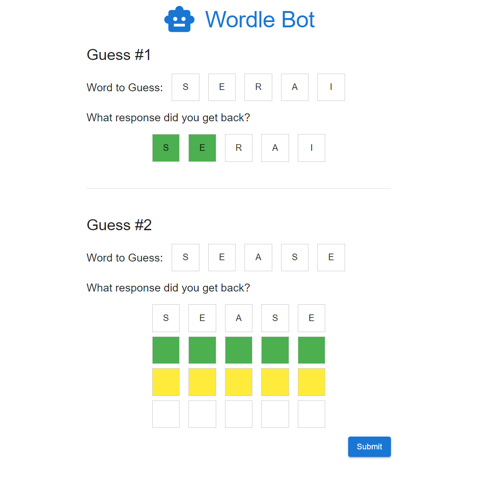
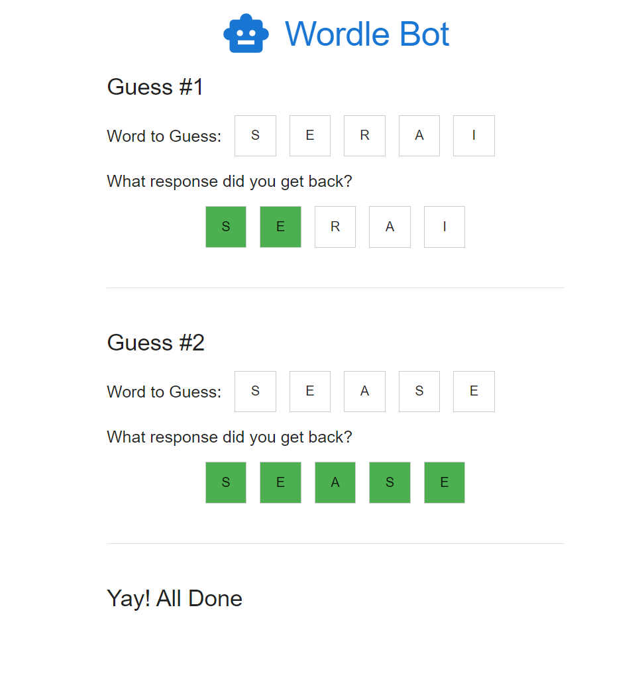
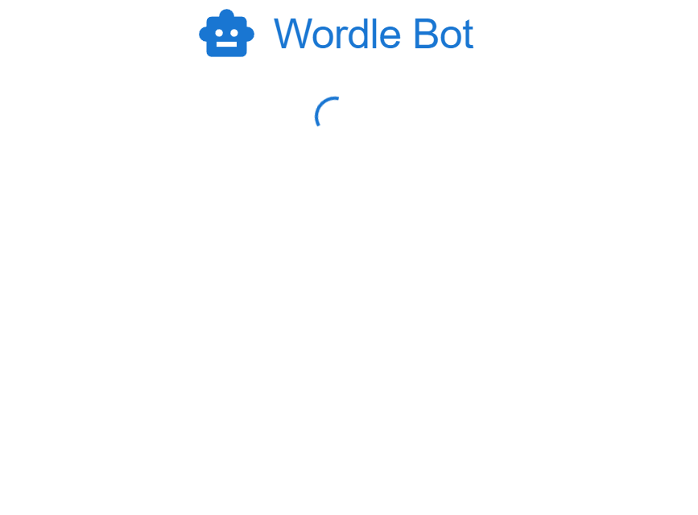
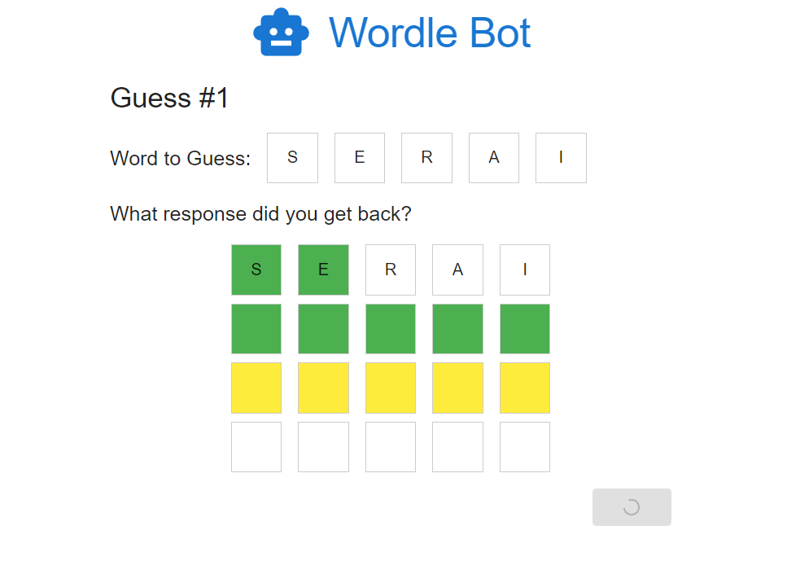
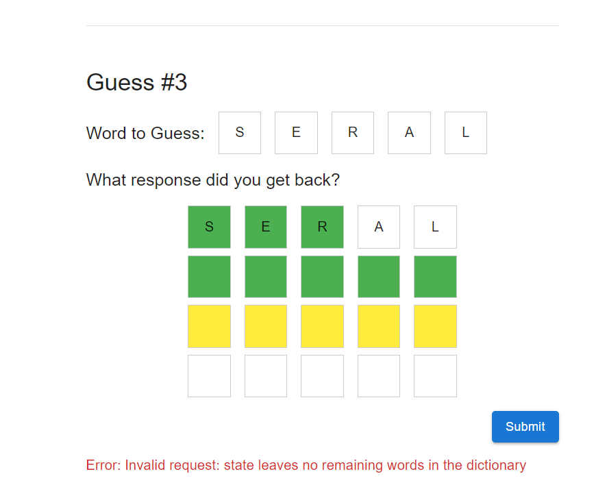

# Wordle Bot

This application is to create a user interface for our Wordle solver API that gives the user recommendations for each guess in solving a Wordle.  If you you aren't familiar with Wordle, you can play a game here: [https://nytimes.com/games/wordle/index.html]([Wordle](https://nytimes.com/games/wordle/index.html)).

The user flow is as follows:
1. The user gets a suggestion from the bot for the initial word to guess.
2. In a separate tab/window, the user enters the word into their game of Wordle and gets the color-coded clue (green, yellow, and white clues) in response.
3. The user enters in the clue they received and submits it to the bot.
4. The bot responds with the next word to guess.
5. Steps 2-4 are repeated until the all boxes are green (winning the game) or all 6 guess attempts are used (losing the game).


You'll be expected to build and deploy a working application that uses the API.  This app has been designed to be no more than a few hours from start to finish.  Below are various details that you may find helpful in completing the project.

## Functional Requirements

1. Users should see an initial guess loaded from the API.
2. Users should be able to enter in the puzzle clues back from Wordle, which will provide a new suggestion to the user.
3. Upon submitting all greens, display a success message to the user and don't show or solicit any more suggestions.
4. Users should have responsive feedback when the app is interacting with the server.
    - Loading indicator while fetching the initial guess
    - When submitting clues to the API, the submit button should be disabled and the user should have a loading indicator.
5. Errors from the API should be displayed to the end user and handled appropriately.


## Example Visuals

The goal of this project is to test your capabilities around implementing a web application.  To help, below are some sample visuals to help you understand the requirements.  You are welcome to change the user experience as you see desire so long as it meets the above functional requirements.

### Iterating through the guesses


### Completing the puzzle


### Handling initial load


### Handling submission load


### Error Handling


## API Details

Endpoint:
POST https://interviewing.venteur.co/api/wordle

This endpoint will return the next guess from the wordle bot based upon the history of all clues-word pairs.

request body schema:

```tsx
type WordleRequestItem = {
	word: string;
	clue: string;
};

type WordleRequest = WordleRequestItem[];
```

response body schema:

```tsx
type WordleResponse = {
	guess: string;
}
```

sample request:

```tsx
[
	{
		"word": "serai",
		"clue": "gxyxx"
	}
]
```

sample response:

```tsx
{
	"guess": "barye"
}
```

There is some level of validation on the request object. Attempts to pass invalid input will likely end in an error. Examples:

| Error | Example message |
| --- | --- |
| Empty request body | Invalid request: must have a valid state object as the HTTP body |
| Request is not an array | Invalid request: state must be an array |
| Passing in too many items (6 or more) | Invalid request: state must be an array with 0-5 items in it |
| Array entry is not an object | Invalid request: state item at index 0 is not a valid object |
| Array entry is missing 'word' field OR 'word' field is not a string OR 'word' field is not 5 characters long | Invalid request: state item at index 0 does not have a 'word' string property that is 5 characters long |
| 'word' field is not 5 alpha (a-z, A-Z) characters | Invalid request: state item at index 0 has a 'word' string property with invalid characters |
| Array entry is missing 'clue' field OR 'clue' field is not a string OR 'clue' field is not 5 characters long | Invalid request: state item at index 0 does not have a 'clue' string property that is 5 characters long |
| 'clue' field is not 5 clue (g, G, y, Y, x, X) characters | Invalid request: state item at index 0 has a 'clue' string property with invalid characters |
| The requested items eliminates all the words in the dictionary (i.e. not solvable) | Invalid request: state leaves no remaining words in the dictionary |

